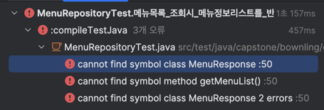

## TDD 코드 작성 과정 셀프 회고

### 0. 메뉴 목록 조회 API
```
@ExtendWith(MockitoExtension.class)
public class MenuRepositoryTest {
    @Mock
    private MenuRepository menuRepository;

    @InjectMocks
    private MenuService menuService;

    @Test
    void 메뉴_목록을_조회한다_Mock의존_01 () {
        // 기존 동작 방식을 먼저 알고 있기 때문에, 구현을 먼저 숙지한채로 작성한 코드 (Test Last Development)
        // 로직에 대한 관심보다 기반 데이터 설정에 대한 관심이 훨씬 많고, 그에 대한 목킹이 대부분. 이미 구현된 메서드에 대해 테스트를 작성
        var menuList = List.of(
                Menu.builder().menuId(1L).menuNm("아이스 아메리카노").menuPrice(15L).build(),
                Menu.builder().menuId(2L).menuNm("카페 라떼").menuPrice(12L).build(),
                Menu.builder().menuId(3L).menuNm("아이스티").menuPrice(11L).build()
        );

        given(menuRepository.findAll()).willReturn(menuList);

        var result = menuRepository.findAll();
        assertThat(result).hasSize(3);
        assertThat(result.get(0).getMenuNm()).isEqualTo("아이스 아메리카노");
        assertThat(result.get(1).getMenuPrice()).isEqualTo(12L);
    }
```

- 조회 API를 작성하였는데, 조회에 대한 테스트 코드를 작성하는게 어떤 의미가 있을지 약간의 의구심이 듬.
  - 조회 API를 TDD 로먼저 테스트 로 개발하면 어떤 이점이 있을까???
  - 해당 코드는 단순 데이터를 먼저 넣기 때문에 이미 내부 구현을 아는 상태로 테스트 코드를 작성하는 것이 아닌가?
  - 뭔가 TDD의 목적에서 다소 벗어난 느낌..


> 내가 작성한 코드는 ?
> 
> 단순히 데이터를 먼저 때려놓고 확인만 한것..
> 
> TDD는 스펙 정의 → 최소 구현 → 리팩토링이 핵심, `조회 API더라도 스펙부터 적어서 TDD의 목적을 지킬것..`
> 
> 하지만 계약(Contract) 보장, 협업, 회귀 테스트 측면에서는 여전히 큰 이점이 있다


`내가 느낀 TDD의 핵심은 실패 코드로 부터 의도하려는 코드를 점차 완성시켜서, 마지막에 리팩토링으로 마무리한다! 이기에`

=> 단순 조회 API더라도 어떤 데이터와 형식을 반환하는지 미리 작성할 수 있음.

=> 그렇기에, 실패코드 부터 먼저 작성하고 점진적으로 기능과 코드를 완성하는 식으로..? 진행을 한다면?

---
### 1. 요구사항 정의하기
  - 메뉴는 이름과, 가격을 가진다.
  - 메뉴 API는 메뉴들을 리스트로 반환하여야함.
  - 반환 데이터는 메뉴 ID, 메뉴 명, 메뉴 가격(포인트) 정보를 가짐.

```
import org.junit.jupiter.api.Test;
import static org.assertj.core.api.Assertions.assertThat;

import java.util.List;

class MenuServiceTest {

    private MenuService menuService;

    @Test
    void 메뉴목록_조회시_메뉴정보리스트를_반환한다_RedTest() {
        // given
        // 아직 데이터 저장이 없으니, 나중에 목업 DB 혹은 Stub을 쓸 수도 있음

        // when
        List<MenuResponse> result = menuService.getMenuList();

        // then
        assertThat(result).hasSize(3);
        assertThat(result.get(0).getMenuName()).isEqualTo("아이스 아메리카노");
        assertThat(result.get(0).getMenuPrice()).isEqualTo(15L);
    }
}
```


`테스트는 실패하였지만, 원하는 결과를 미리 작성할 수 있음.` -> `컴파일 오류를 해결하는 방식으로 다음단계 진행`

---
### 2. 최소 실행 가능 코드 작성
`코드가 동작할 수 있는 최소 조건을 테스트에 맞춰서 먼저 작성하기 (?)`

- 아래코드로 컴파일이 가능하고 Green 상태로 테스트를 통과할 수 있음.
- 이제 동작 방식을 의도하였으니, 실제 코드를 구현하여 스펙을 완성할 수 있을까?
```
@ExtendWith(MockitoExtension.class)
public class MenuRepositoryTest {
    @Mock
    private MenuRepository menuRepository;

    @InjectMocks
    private MenuService menuService;
    
    @Test
    void 메뉴목록_조회시_메뉴정보리스트를_반환한다_RedTest() {
        // when
        List<MenuResponse> result = menuService.getMenuList();
    
        // then
        assertThat(result).hasSize(3);
        assertThat(result.get(0).getMenuName()).isEqualTo("아이스 아메리카노");
        assertThat(result.get(0).getMenuPrice()).isEqualTo(15L);
    }
}

@Service
public class MenuService {
    public List<MenuResponse> getMenuList() {
        return List.of(
                new MenuResponse(1L, "아이스 아메리카노", 15L),
                new MenuResponse(2L, "카페 라떼", 12L),
                new MenuResponse(3L, "아이스티", 11L)
        );
    }

}

public class MenuResponse{
    private Long menuId;
    private String menuNm;
    private Long menuPrice;
    
    // 생성자, getter
}
```

---

### 3. 리팩토링 - 실제 코드 구현하기 (테스트 스펙 기반)

`앞선, 요구사항과 의도 동작/스펙을 기반으로 실제 코드를 리팩토링하고 구현한다!`

```
@ExtendWith(MockitoExtension.class)
public class MenuRepositoryTest {
    @Mock
    private MenuRepository menuRepository;

    @InjectMocks
    private MenuService menuService;
    
    @Test
    void 메뉴목록_조회시_메뉴정보리스트를_반환한다_RedTest() {
        // when
        List<MenuResponse> result = menuService.getMenuList();
    
        // then
        assertThat(result).hasSize(3);
        assertThat(result.get(0).getMenuName()).isEqualTo("아이스 아메리카노");
        assertThat(result.get(0).getMenuPrice()).isEqualTo(15L);
    }
}

@Service
@RequiredArgsConstructor
public class MenuService {

    private final MenuRepository menuRepository;

    public List<MenuResponse> getMenuList() {

        return menuRepository.findAll().stream().map(menu -> new MenuResponse(
                menu.getMenuId(),
                menu.getMenuNm(),
                menu.getMenuPrice()
        )).toList();
    }
}
```

- 오, 이렇게 해보니까 테스트 코드에서 어떤 값을 요구할지 미리 설정을 할 수 있다는 느낌을 강하게 받을 수 있다.
- 테스트 코드로 동작을 먼저 명시하고, 그 이후 실제 동작 할 코드와 의존성을 주입함으로써 설계-구현 까지의 과정을 일련화 하기 편함.
- 또한, 리펙토링 시에 테스트 코드를 통해 (Red) 상태를 어떻게 피할지도 보장을 해줌으로써, 서버실행까지 가지 않더라도 테스트 코드 내에서 코드 정상 동작을 증명할 수 있었음.
- `코드가 실행되지 않는다면, 기존 요구사항에서 깨진다는 것을 명시할 수 있다!!`

>정리하자면, TDD로 설계한다는 건 “내가 원하는 결과(스펙)를 테스트 코드로 먼저 적고, 그걸 만족하는 코드를 점진적으로 만드는 과정”
> 
> 이 과정을 통해 설계가 깔끔해지고, 협업도 쉬워질 듯 하다!